<!-- Animated Hacker Terminal Header -->

 

<!-- Hacker Style Badges -->

 

<h3>visitor@cyberullu-desktop:~$ whoami</h3>

<pre><code>Cyber security enthusiast, bug hunter, security researcher, and VAPT learner
focused on ethical hacking, penetration testing, vulnerability research, and
building practical tools that make digital systems safer.</code></pre>

<!-- Offensive/Defensive Tools Badges -->

<h3>visitor@cyberullu-desktop:~$ cat about_me.md</h3>

<pre><code>[+] Name       : Midhun Subhash
[+] Role       : Bug Hunter | Cybersecurity Consultant | Cybersecurity Researcher
[+] Focus      : VAPT, Ethical Hacking, Vulnerability Research
[+] Mindset    : Break ethically. Learn deeply. Report clearly. Harden systems.</code></pre>

<h3>visitor@cyberullu-desktop:~$ ls -la ./projects/</h3>

<pre><code>drwxr-xr-x  phishing-link-catcher   Chrome extension for real-time malicious URL detection
drwxr-xr-x  packet-sniffer-tool      Network traffic capture and packet-level analysis
drwxr-xr-x  key-logger               Lab project for endpoint monitoring concepts
drwxr-xr-x  password-checker         Password strength assessment and security guidance</code></pre>

<table>
  <thead>
    <tr>
      <th>Project</th>
      <th>Type</th>
      <th>Signal / Functionality</th>
    </tr>
  </thead>
  <tbody>
    <tr>
      <td><strong>Real-Time Phishing Link Catcher</strong></td>
      <td>Chrome Extension</td>
      <td>Detects suspicious, malicious, and phishing URLs while browsing</td>
    </tr>
    <tr>
      <td><strong>Packet Sniffer Tool</strong></td>
      <td>Offensive Security Tool</td>
      <td>Captures and analyzes live network traffic</td>
    </tr>
    <tr>
      <td><strong>Key Logger</strong></td>
      <td>Offensive Security Lab Tool</td>
      <td>Explores keyboard events, monitoring, and endpoint security impact</td>
    </tr>
    <tr>
      <td><strong>Password Checker</strong></td>
      <td>Defensive Security Tool</td>
      <td>Evaluates length, complexity, and character diversity</td>
    </tr>
  </tbody>
</table>

<h3>visitor@cyberullu-desktop:~$ ./view_experience.sh --latest</h3>

<pre><code>[Jan 2025 - Jun 2025] WizardLegal
  -> Junior Cybersecurity Analyst
  -> Security assessments, reporting, remediation guidance, attack-vector research
  -> Manual web application testing including XSS, SQL Injection, and related flaws

[Aug 2024 - Sep 2024] Prodigy InfoTech
  -> Cyber Security Intern
  -> Built offensive and defensive security tools while completing assigned tasks</code></pre>

<h3>visitor@cyberullu-desktop:~$ ./run_methodology.py</h3>

<pre><code>[01] Reconnaissance
[02] Vulnerability Assessment
[03] Web Application Pentesting
[04] Wireless Pentesting
[05] Exploit Validation
[06] Risk Analysis
[07] Vulnerability Report Generation
[08] Remediation Guidance</code></pre>

<h3>visitor@cyberullu-desktop:~$ cat achievements.log</h3>

<pre><code>[*] Top 3% worldwide ranking on TryHackMe
[*] P5 level information for bug hunting in Bugcrowd
[*] Completed 100+ rooms and earned 16 TryHackMe badges
[*] Cisco Cyber Threat Management badge
[*] Cisco verified badge and cybersecurity certification
[*] Conducted and participated in 50+ CTF competitions
[*] Earned multiple TryHackMe learning-path certifications</code></pre>

<h3>visitor@cyberullu-desktop:~$ neofetch --github-stats</h3>

<!-- Cyber Hacker-Themed GitHub Stats -->

 

<h3>visitor@cyberullu-desktop:~$ ./render_contribution_graph.sh</h3>

<!-- Contribution Grid Snake Animation -->
<picture>
  <source media="(prefers-color-scheme: dark)" srcset="https://raw.githubusercontent.com/cyberullu/cyberullu/output/github-contribution-grid-snake-dark.svg" />
  <source media="(prefers-color-scheme: light)" srcset="https://raw.githubusercontent.com/cyberullu/cyberullu/output/github-contribution-grid-snake.svg" />
  
</picture>

 

<h3>visitor@cyberullu-desktop:~$ ./get_contact_info.py</h3>

<pre><code>Portfolio : https://midhun-subhash-portfolio.netlify.app/
GitHub    : https://github.com/cyberullu
LinkedIn  : https://www.linkedin.com/in/midhun-subhash-a671732b6/
Email     : md0038959@gmail.com</code></pre>

